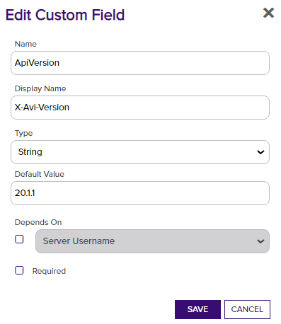

<h1 align="center" style="border-bottom: none">
    VMware NSX Advanced Load Balancer (Avi) Universal Orchestrator Extension
</h1>

<p align="center">
  <!-- Badges -->

<a href="https://github.com/Keyfactor/vmware-nsx-orchestrator/releases"></a>


</p>

<p align="center">
  <!-- TOC -->
  <a href="#support">
    <b>Support</b>
  </a>
  ·
  <a href="#installation">
    <b>Installation</b>
  </a>
  ·
  <a href="#license">
    <b>License</b>
  </a>
  ·
  <a href="https://github.com/orgs/Keyfactor/repositories?q=orchestrator">
    <b>Related Integrations</b>
  </a>
</p>


## Overview

The VMware NSX Advanced Load Balancer (Avi) Universal Orchestrator extension enables the remote management of cryptographic certificates on VMware NSX ALB instances. This integration facilitates automated certificate operations such as inventory, adding, removing, and discovering certificates within Keyfactor Command.

VMware NSX Advanced Load Balancer uses certificates for SSL offloading and secure communication. The types of certificates managed include Application and System certificates, which require private keys, and CA certificates, which are used for building and validating certificate chains without needing private keys.

In this integration, Certificate Stores represent specific NSX ALB instances (and optionally tenants) associated with particular certificate types. Each Certificate Store configuration allows administrators to manage certificates on a per-instance and per-certificate type basis, streamlining certificate management tasks across multiple NSX ALB deployments.

## Compatibility

This integration is compatible with Keyfactor Universal Orchestrator version  and later.

## Support
The VMware NSX Advanced Load Balancer (Avi) Universal Orchestrator extension is supported by Keyfactor for Keyfactor customers. If you have a support issue, please open a support ticket with your Keyfactor representative. If you have a support issue, please open a support ticket via the Keyfactor Support Portal at https://support.keyfactor.com. 
 
> To report a problem or suggest a new feature, use the **[Issues](../../issues)** tab. If you want to contribute actual bug fixes or proposed enhancements, use the **[Pull requests](../../pulls)** tab.

## Installation
Before installing the VMware NSX Advanced Load Balancer (Avi) Universal Orchestrator extension, it's recommended to install [kfutil](https://github.com/Keyfactor/kfutil). Kfutil is a command-line tool that simplifies the process of creating store types, installing extensions, and instantiating certificate stores in Keyfactor Command.


1. Follow the [requirements section](docs/vmware-nsx.md#requirements) to configure a Service Account and grant necessary API permissions.

    <details><summary>Requirements</summary>

    ### VMware NSX ALB Configuration
    The NSX ALB platform needs some configuration in order to allow the Orchestrator to communicate with it.
    The listed SSL/TLS certificate under Administration -> Settings -> Access Settings  needs to be trusted by the Orchestrator so that HTTPS can be used successfully.

    A user also needs to be set up with a password that can be used to authenticate during Orchestrator requests. This user should be a Tenant Admin or Security Admin on the tenant that will be managed.
    If a user should be used for multiple tenants, they will need to be a system admin. The tenant that they are initially assigned to be will be considered the "default" tenant if no tenant is specified for the certificate store.

    ### VMware NSX ALB Orchestrator Extension Configuration
    **1. Create the New Certificate Store Type for the NSX orchestrator extension**

    The easiest way to create the Certificate Store Type is to use the `kfutil` tool to automatically install the Store Type definition. However, you can manually add it with the information below.
    In Keyfactor Command create a new Certificate Store Type similar to the one below by clicking Settings (the gear icon in the top right) => Certificate Store Types => Add:

    
    

    You will also need to add the following Custom Field if you want to be able to set the X-Avi-Version to target a version other than 20.1.1. 

    

    **2. Create a new NSX Certificate Store**

    After the Certificate Store Type has been configured, a new NSX Certificate Store can be created.
    When creating the store, if a tenant other than the API user's default tenant should be used, the Client Machine should be preface with [tenant] in brackets.

    | Certificate Store parameter | Input | Alternative Input |
    |-|-|-|
    | Client Machine | [optional-tenant-name]https://my.nsx.url/ | https://my.nsx.url/ |
    | Store Path | Application | CA (or Controller) |
    | X-Avi-Version | 20.1.1 (default value) | 18.2.9 |

    **3. Adding or Replacing (Renewing) Certificates**
    The required alias acts as the name for the certificate in the VMware NSX ALB system. These are also used to renew/replace and delete existing certificates.
    When adding a certificate, selecting `Overwrite` and entering the same name (alias) as an existing certificate will replace that certificate, allowing for renewals of existing certificates.

    Additionally, while private keys are optional for CA type certificates, they _are required_ for Application or Controller type certificates.


    </details>

2. Create Certificate Store Types for the VMware NSX Advanced Load Balancer (Avi) Orchestrator extension. 

    * **Using kfutil**:

        ```shell
        # VMware-NSX
        kfutil store-types create VMware-NSX
        ```

    * **Manually**:
        * [VMware-NSX](docs/vmware-nsx.md#certificate-store-type-configuration)

3. Install the VMware NSX Advanced Load Balancer (Avi) Universal Orchestrator extension.
    
    * **Using kfutil**: On the server that that hosts the Universal Orchestrator, run the following command:

        ```shell
        # Windows Server
        kfutil orchestrator extension -e vmware-nsx-orchestrator@latest --out "C:\Program Files\Keyfactor\Keyfactor Orchestrator\extensions"

        # Linux
        kfutil orchestrator extension -e vmware-nsx-orchestrator@latest --out "/opt/keyfactor/orchestrator/extensions"
        ```

    * **Manually**: Follow the [official Command documentation](https://software.keyfactor.com/Core-OnPrem/Current/Content/InstallingAgents/NetCoreOrchestrator/CustomExtensions.htm?Highlight=extensions) to install the latest [VMware NSX Advanced Load Balancer (Avi) Universal Orchestrator extension](https://github.com/Keyfactor/vmware-nsx-orchestrator/releases/latest).

4. Create new certificate stores in Keyfactor Command for the Sample Universal Orchestrator extension.

    * [VMware-NSX](docs/vmware-nsx.md#certificate-store-configuration)


## License

Apache License 2.0, see [LICENSE](LICENSE).

## Related Integrations

See all [Keyfactor Universal Orchestrator extensions](https://github.com/orgs/Keyfactor/repositories?q=orchestrator).