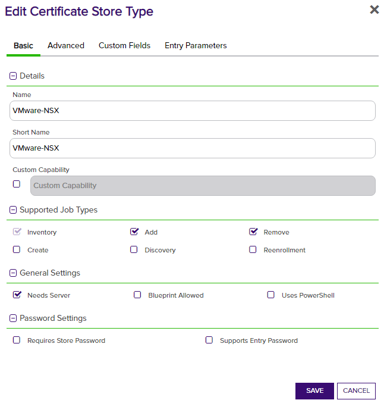
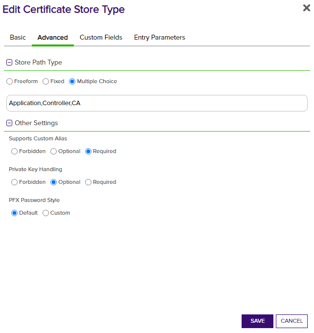

# VMware NSX Advanced Load Balancer (Avi)

The VMware NSX Advanced Load Balancer (formerly Avi Vantage) Orchestrator allows for the management of certificates stored in the VMware NSX ALB solution. Application, System, and CA cert types are supported. Inventory, Management, and Renewal functions are supported.

#### Integration status: Production - Ready for use in production environments.

## About the Keyfactor Universal Orchestrator Extension

This repository contains a Universal Orchestrator Extension which is a plugin to the Keyfactor Universal Orchestrator. Within the Keyfactor Platform, Orchestrators are used to manage “certificate stores” &mdash; collections of certificates and roots of trust that are found within and used by various applications.

The Universal Orchestrator is part of the Keyfactor software distribution and is available via the Keyfactor customer portal. For general instructions on installing Extensions, see the “Keyfactor Command Orchestrator Installation and Configuration Guide” section of the Keyfactor documentation. For configuration details of this specific Extension see below in this readme.

The Universal Orchestrator is the successor to the Windows Orchestrator. This Orchestrator Extension plugin only works with the Universal Orchestrator and does not work with the Windows Orchestrator.

---

## Platform Specific Notes

The Keyfactor Universal Orchestrator may be installed on either Windows or Linux based platforms. The certificate operations supported by a capability may vary based what platform the capability is installed on. The table below indicates what capabilities are supported based on which platform the encompassing Universal Orchestrator is running.
| Operation | Win | Linux |
|-----|-----|------|
|Supports Management Add|&check; |&check; |
|Supports Management Remove|&check; |&check; |
|Supports Create Store|  |  |
|Supports Discovery|  |  |
|Supports Renrollment|  |  |
|Supports Inventory|&check; |&check; |

---


## Use Cases
The VMware NSX ALB certificate store type is set up so that each Certificate Store points to a specific NSX ALB instance (and optionally a specific tenant) and certificate type.
For multiple certificate types on the same NSX instance, create a certificate store for each type to manage.

Application and System certs are used by NSX ALB for SSL offloading and require private keys. CA certs are used to build and validate certificate chains and do not require private keys.

## VMware NSX ALB Configuration
The NSX ALB platform needs some configuration in order to allow the Orchestrator to communicate with it.
Basic Authentication needs to be enabled. Under Administration -> Settings -> Access Settings edit the System Access settings to allow Basic Authentication.
The listed SSL/TLS certificate also needs to be trusted by the Orchestrator so that HTTPS can be used successfully.

A user also needs to be set up with a password that can be used to authenticate during Orchestrator requests. This user should be a Tenant Admin or Security Admin on the tenant that will be managed.
If a user should be used for multiple tenants, they will need to be a system admin. The tenant that they are initially assigned to be will be considered the "default" tenant if no tenant is specified for the certificate store.

## VMware NSX ALB Orchestrator Extension Configuration
**1. Create the New Certificate Store Type for the NSX orchestrator extension**

In Keyfactor Command create a new Certificate Store Type similar to the one below by clicking Settings (the gear icon in the top right) => Certificate Store Types => Add:

**2. Create a new NSX Certificate Store**

After the Certificate Store Type has been configured, a new NSX Certificate Store can be created.
When creating the store, if a tenant other than the API user's default tenant should be used, the Client Machine should be preface with [tenant] in brackets.

| Certificate Store parameter | Input | Alternative Input |
|-|-|-|
| Client Machine | [optional-tenant-name]https://my.nsx.url/ | https://my.nsx.url/ |
| Store Path | Application | CA (or Controller) |

**3. Adding or Replacing (Renewing) Certificates**
The required alias acts as the name for the certificate in the VMware NSX ALB system. These are also used to renew/replace and delete existing certificates.
When adding a certificate, selecting `Overwrite` and entering the same name (alias) as an existing certificate will replace that certificate, allowing for renewals of existing certificates.

Additionally, while private keys are optional for CA type certificates, they _are required_ for Application or Controller type certificates.

