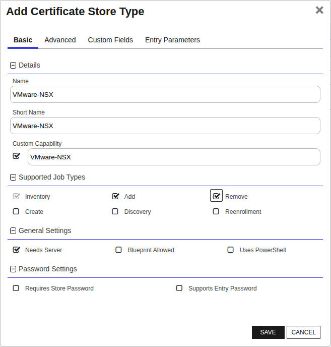
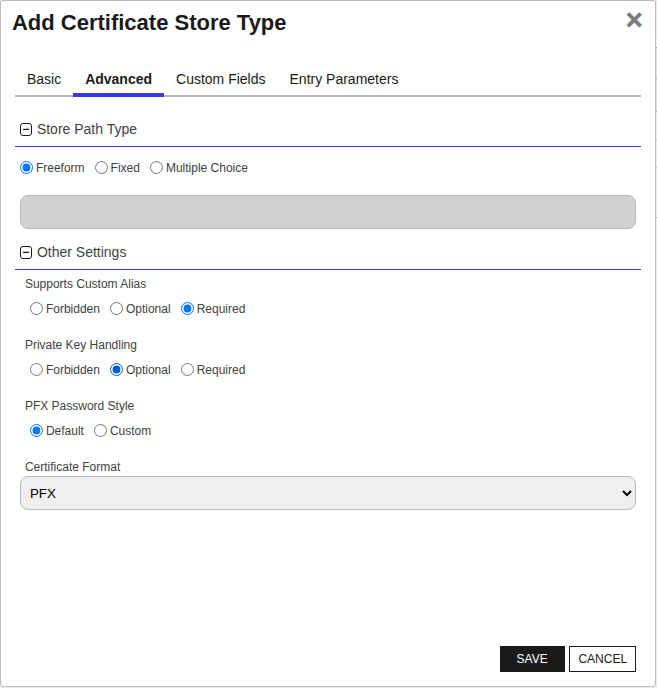
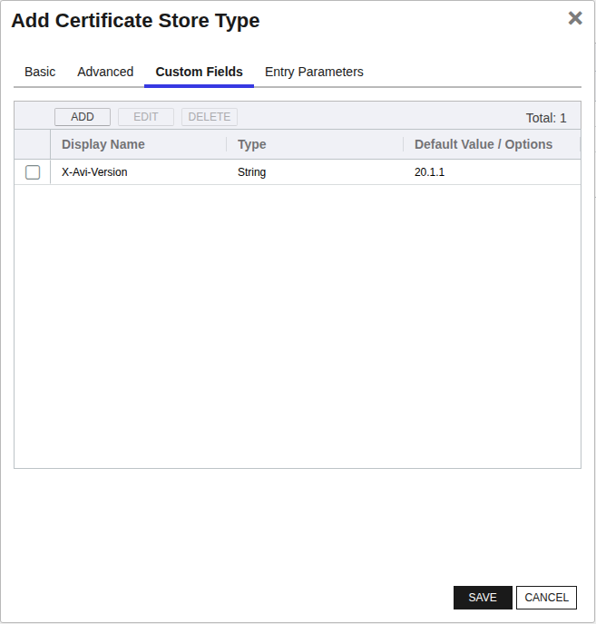

## VMware-NSX

The VMware-NSX Certificate Store Type in Keyfactor Command allows for the streamlined management of SSL/TLS certificates on VMware NSX Advanced Load Balancer (Avi) instances. This store type is configured to point to a specific NSX ALB instance and, optionally, a specific tenant and certificate type, facilitating granular control over certificates for different functionalities such as SSL offloading and certificate chain validation.

The Certificate Store Type represents a target NSX ALB environment, helping administrators to handle certificates for Application, System, and CA types uniquely. Application and System certificates require private keys, whereas CA certificates do not.

### Caveats and Considerations

- **User Permissions:** The user configured for the orchestrator must be either a Tenant Admin or Security Admin for single-tenancy management or a System Admin for multi-tenancy management.
- **Trust Requirements:** The SSL/TLS certificate listed under Administration -> Settings -> Access Settings on the NSX ALB platform needs to be trusted by the orchestrator to ensure secure HTTPS communication.
- **Version Targeting:** A custom field can be added to set the X-Avi-Version to target specific NSX ALB versions, providing flexibility in managing environments running different software versions.

### SDK and Limitations

While the documentation does not specify the usage of an SDK, the integration relies on NSX ALB's API for interacting with and managing certificates. There are no significant limitations or areas of confusion mentioned, but administrators should ensure they configure the correct user permissions and SSL/TLS trust settings for seamless operation.


### Supported Job Types

| Job Name | Supported |
| -------- | --------- |
| Inventory | ✅ |
| Management Add | ✅ |
| Management Remove | ✅ |
| Discovery |  |
| Create |  |
| Reenrollment |  |

## Requirements

### VMware NSX ALB Configuration
The NSX ALB platform needs some configuration in order to allow the Orchestrator to communicate with it.
The listed SSL/TLS certificate under Administration -> Settings -> Access Settings  needs to be trusted by the Orchestrator so that HTTPS can be used successfully.

A user also needs to be set up with a password that can be used to authenticate during Orchestrator requests. This user should be a Tenant Admin or Security Admin on the tenant that will be managed.
If a user should be used for multiple tenants, they will need to be a system admin. The tenant that they are initially assigned to be will be considered the "default" tenant if no tenant is specified for the certificate store.

### VMware NSX ALB Orchestrator Extension Configuration
**1. Create the New Certificate Store Type for the NSX orchestrator extension**

The easiest way to create the Certificate Store Type is to use the `kfutil` tool to automatically install the Store Type definition. However, you can manually add it with the information below.
In Keyfactor Command create a new Certificate Store Type similar to the one below by clicking Settings (the gear icon in the top right) => Certificate Store Types => Add:


You will also need to add the following Custom Field if you want to be able to set the X-Avi-Version to target a version other than 20.1.1. 


**2. Create a new NSX Certificate Store**

After the Certificate Store Type has been configured, a new NSX Certificate Store can be created.
When creating the store, if a tenant other than the API user's default tenant should be used, the Client Machine should be preface with [tenant] in brackets.

| Certificate Store parameter | Input | Alternative Input |
|-|-|-|
| Client Machine | [optional-tenant-name]https://my.nsx.url/ | https://my.nsx.url/ |
| Store Path | Application | CA (or Controller) |
| X-Avi-Version | 20.1.1 (default value) | 18.2.9 |

**3. Adding or Replacing (Renewing) Certificates**
The required alias acts as the name for the certificate in the VMware NSX ALB system. These are also used to renew/replace and delete existing certificates.
When adding a certificate, selecting `Overwrite` and entering the same name (alias) as an existing certificate will replace that certificate, allowing for renewals of existing certificates.

Additionally, while private keys are optional for CA type certificates, they _are required_ for Application or Controller type certificates.


## Certificate Store Type Configuration

The recommended method for creating the `VMware-NSX` Certificate Store Type is to use [kfutil](https://github.com/Keyfactor/kfutil). After installing, use the following command to create the `` Certificate Store Type:

```shell
kfutil store-types create VMware-NSX
```

<details><summary>VMware-NSX</summary>

Create a store type called `VMware-NSX` with the attributes in the tables below:

### Basic Tab
| Attribute | Value | Description |
| --------- | ----- | ----- |
| Name | VMware-NSX | Display name for the store type (may be customized) |
| Short Name | VMware-NSX | Short display name for the store type |
| Capability | VMware-NSX | Store type name orchestrator will register with. Check the box to allow entry of value |
| Supported Job Types (check the box for each) | Add, Discovery, Remove | Job types the extension supports |
| Supports Add | ✅ | Check the box. Indicates that the Store Type supports Management Add |
| Supports Remove | ✅ | Check the box. Indicates that the Store Type supports Management Remove |
| Supports Discovery |  |  Indicates that the Store Type supports Discovery |
| Supports Reenrollment |  |  Indicates that the Store Type supports Reenrollment |
| Supports Create |  |  Indicates that the Store Type supports store creation |
| Needs Server | ✅ | Determines if a target server name is required when creating store |
| Blueprint Allowed |  | Determines if store type may be included in an Orchestrator blueprint |
| Uses PowerShell |  | Determines if underlying implementation is PowerShell |
| Requires Store Password |  | Determines if a store password is required when configuring an individual store. |
| Supports Entry Password |  | Determines if an individual entry within a store can have a password. |

The Basic tab should look like this:



### Advanced Tab
| Attribute | Value | Description |
| --------- | ----- | ----- |
| Supports Custom Alias | Required | Determines if an individual entry within a store can have a custom Alias. |
| Private Key Handling | Optional | This determines if Keyfactor can send the private key associated with a certificate to the store. Required because IIS certificates without private keys would be invalid. |
| PFX Password Style | Default | 'Default' - PFX password is randomly generated, 'Custom' - PFX password may be specified when the enrollment job is created (Requires the Allow Custom Password application setting to be enabled.) |

The Advanced tab should look like this:



### Custom Fields Tab
Custom fields operate at the certificate store level and are used to control how the orchestrator connects to the remote target server containing the certificate store to be managed. The following custom fields should be added to the store type:

| Name | Display Name | Type | Default Value/Options | Required | Description |
| ---- | ------------ | ---- | --------------------- | -------- | ----------- |


The Custom Fields tab should look like this:




</details>

## Certificate Store Configuration

After creating the `VMware-NSX` Certificate Store Type and installing the VMware NSX Advanced Load Balancer (Avi) Universal Orchestrator extension, you can create new [Certificate Stores](https://software.keyfactor.com/Core-OnPrem/Current/Content/ReferenceGuide/Certificate%20Stores.htm?Highlight=certificate%20store) to manage certificates in the remote platform.

The following table describes the required and optional fields for the `VMware-NSX` certificate store type.

| Attribute | Description | Attribute is PAM Eligible |
| --------- | ----------- | ------------------------- |
| Category | Select "VMware-NSX" or the customized certificate store name from the previous step. | |
| Container | Optional container to associate certificate store with. | |
| Client Machine | The URL of the NSX ALB instance, optionally prefixed with the tenant name in brackets if a specific tenant should be used, for example, [tenant-name]https://my.nsx.url/. | |
| Store Path | The type of certificate being managed, such as 'Application' for SSL offloading certificates, 'CA' for Certificate Authority certificates, or 'Controller' for controller certificates. | |
| Orchestrator | Select an approved orchestrator capable of managing `VMware-NSX` certificates. Specifically, one with the `VMware-NSX` capability. | |

* **Using kfutil**

    ```shell
    # Generate a CSV template for the AzureApp certificate store
    kfutil stores import generate-template --store-type-name VMware-NSX --outpath VMware-NSX.csv

    # Open the CSV file and fill in the required fields for each certificate store.

    # Import the CSV file to create the certificate stores
    kfutil stores import csv --store-type-name VMware-NSX --file VMware-NSX.csv
    ```

* **Manually with the Command UI**: In Keyfactor Command, navigate to Certificate Stores from the Locations Menu. Click the Add button to create a new Certificate Store using the attributes in the table above.