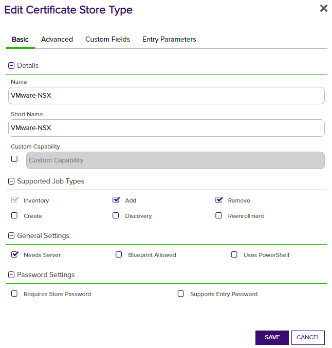
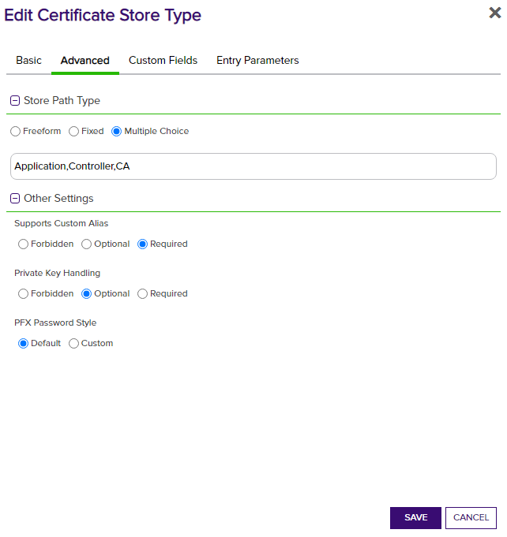
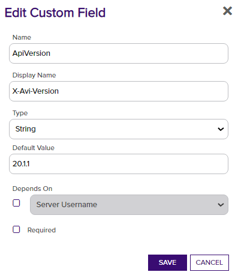


## Use Cases
The VMware NSX ALB certificate store type is set up so that each Certificate Store points to a specific NSX ALB instance (and optionally a specific tenant) and certificate type.
For multiple certificate types on the same NSX instance, create a certificate store for each type to manage.

Application and System certs are used by NSX ALB for SSL offloading and require private keys. CA certs are used to build and validate certificate chains and do not require private keys.

## VMware NSX ALB Configuration
The NSX ALB platform needs some configuration in order to allow the Orchestrator to communicate with it.
The listed SSL/TLS certificate under Administration -> Settings -> Access Settings  needs to be trusted by the Orchestrator so that HTTPS can be used successfully.

A user also needs to be set up with a password that can be used to authenticate during Orchestrator requests. This user should be a Tenant Admin or Security Admin on the tenant that will be managed.
If a user should be used for multiple tenants, they will need to be a system admin. The tenant that they are initially assigned to be will be considered the "default" tenant if no tenant is specified for the certificate store.

## VMware NSX ALB Orchestrator Extension Configuration
**1. Create the New Certificate Store Type for the NSX orchestrator extension**

The easiest way to create the Certificate Store Type is to use the `kfutil` tool to automatically install the Store Type definition. However, you can manually add it with the information below.
In Keyfactor Command create a new Certificate Store Type similar to the one below by clicking Settings (the gear icon in the top right) => Certificate Store Types => Add:

You will also need to add the following Custom Field if you want to be able to set the X-Avi-Version to target a version other than 20.1.1. 

You may also want to add a `RetriesForFailedAuthentication` Custom Field (String, default `0`). NSX ALB can be configured to validate logins against an external identity provider (e.g. LDAP/AD) instead of its own local user store. When that provider is momentarily overwhelmed or unreachable, NSX ALB returns the exact same generic "Invalid credentials" error it would return for an actually wrong password - there's no way to distinguish the two from the response alone. Setting `RetriesForFailedAuthentication` to a value greater than 0 tells the orchestrator to retry the login (with a short, increasing backoff capped at 5 seconds per attempt) that many additional times before giving up, so a transient identity-provider hiccup doesn't fail the job over credentials that were correct the whole time. Leave it at the default of `0` to keep the original behavior (fail immediately on the first rejection) unless you've confirmed your NSX ALB instance uses an external auth provider prone to this.

**2. Create a new NSX Certificate Store**

After the Certificate Store Type has been configured, a new NSX Certificate Store can be created.
When creating the store, if a tenant other than the API user's default tenant should be used, the Client Machine should be preface with [tenant] in brackets.

| Certificate Store parameter | Input | Alternative Input |
|-|-|-|
| Client Machine | [optional-tenant-name]https://my.nsx.url/ | https://my.nsx.url/ |
| Store Path | Application | CA (or Controller) |
| X-Avi-Version | 20.1.1 (default value) | 18.2.9 |
| RetriesForFailedAuthentication | 0 (default value, no retries) | 3 |

**3. Adding or Replacing (Renewing) Certificates**
The required alias acts as the name for the certificate in the VMware NSX ALB system. These are also used to renew/replace and delete existing certificates.
When adding a certificate, selecting `Overwrite` and entering the same name (alias) as an existing certificate will replace that certificate, allowing for renewals of existing certificates.

Additionally, while private keys are optional for CA type certificates, they _are required_ for Application or Controller type certificates.
